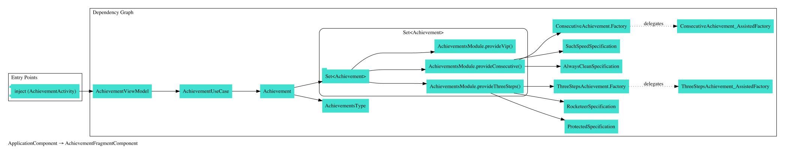

# Playground

This is a project to play around android programming concepts. For now, I am playing with dagger a little bit.

## ApplicationComponent Dependency graph

## AchievementFragmentComponent Dependency graph

## AchievementListComponent Dependency graph

